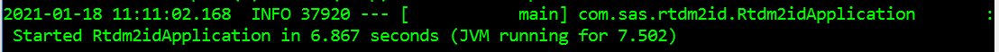
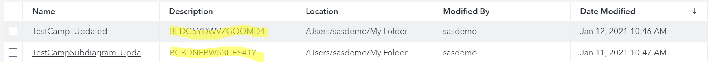

# RTDM to ID Migration

- [RTDM to ID Migration](#rtdm-migrate-to-id)
  - [Overview](#overview)
    - [Prerequisites](#prerequisites)
    - [Installation](#installation)
  - [Getting Started](#getting-started)
  - [Running](#running)
    - [Examples](#examples)
    - [Capabilities](#capabilities)
  - [Support](#support)
    - [SAS Communities](#sas-communities)
    - [SAS Documentation](#sas-documentation)
    - [GitHub Issues](#github-issues)
  - [Contributing](#contributing)
  - [License](#license)

## Overview
Tool to migrate campaigns from SAS Real-Time Decision Manager (RTDM) to SAS Intelligent Decisioning (ID).

### Prerequisites
Campaigns from RTDM need to be extracted using SAS Customer Intelligence Integration Utilities.
This step must be performed before running the migration tool.

[SAS Customer Intelligence Integration Utilities documentation](https://documentation.sas.com/?activeCdc=cicmncdc&cdcId=cicdc&cdcVersion=6.6&docsetId=ciintutilug&docsetTarget=titlepage.htm)


### Installation
Download this project and build using provided Maven pom.xml file.

```shell script
mvn clean install
```
This will generate a jar file under the \target folder.

## Getting Started
Migrating campaigns from RTDM to ID is a 3-step process.
* Extract campaigns from RTDM using SAS Customer Intelligence Integration Utilities. This creates an extract XML file.
* Start rtdm-migrate-to-id tool
* Issue REST requests to rtdm-migrate-to-id tool using the extract XML file as input.

## Running
Run the migration tool from a command/shell window.

```shell script
java -jar rtdm-migrate-to-id-0.8.2.jar

or
# if port 8080 already in use
java -Dserver.port=8086 -jar rtdm-migrate-to-id-0.8.2.jar
```

This row inside command/shell will tell you that service successfully started


RTDM Subdiagrams must be migrated before migrating parent diagram.

### Examples
Authenticate with SAS Viya to get an authorization token.
* https://developer.sas.com/apis/rest/#authentication-to-sas-viya
* https://github.com/sassoftware/devsascom-rest-api-samples/blob/master/CoreServices/sasLogon.md

Once authenticated user can POST requests.

```shell script
POST: localhost:8080/api/rtdm2id/create-diagram?baseIp={{ID environment}}&login={username}&password={password}&protocol={protocol}&parentFolderUri={parentFolderUri}
Authorization: Bearer {{token}}
Content-Type: application/xml
Body: Extract XML generated from SAS Customer Intelligence Integration Utilities

Example Body: extract/extracted_campaign.xml
```
The parameter protocol is optional. The default value is "http" if not provided. If the target environment is using HTTPS for secure online transactions then protocol must be provided with a value of "https".

The parameter parentFolderUri is optional. The default value is /folders/folders/@myFolder if not provided.
### Capabilities

* Creation of DS2 Node process in ID from RTDM DS2 Process
* Creation of SQL Node process in ID from RTDM Data Process
* Creation of Decision input/output variables in ID from RTDM event variables
* Creation of Assignment Rule Set in ID from RTDM Reply Node
* Creation of Assignment Rule Set in ID from RTDM calculated variables
* RTDM Subdiagrams must be migrated before migrating parent diagram
  

## Support

### SAS Communities
Ask questions on the [Decisioning Community Web Site](https://communities.sas.com/t5/Decisioning/bd-p/decisioning).

### SAS Documentation

[SAS Customer Intelligence Integration Utilities](https://documentation.sas.com/?activeCdc=cicmncdc&cdcId=cicdc&cdcVersion=6.6&docsetId=ciintutilug&docsetTarget=titlepage.htm)

[Authentication to SAS Viya](https://developer.sas.com/apis/rest/#authentication-to-sas-viya)

[SAS Logon API](https://github.com/sassoftware/devsascom-rest-api-samples/blob/master/CoreServices/sasLogon.md)

### GitHub Issues

See the [SUPPORT.md](SUPPORT.md) file for information on how to open an issue against this repository.

## Contributing
> We welcome your contributions! Please read [CONTRIBUTING.md](CONTRIBUTING.md) for details on how to submit contributions to this project.

## License
> This project is licensed under the [Apache 2.0 License](LICENSE).